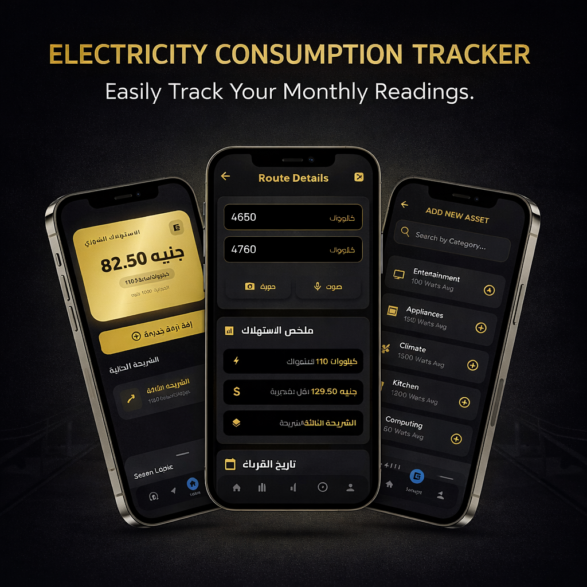
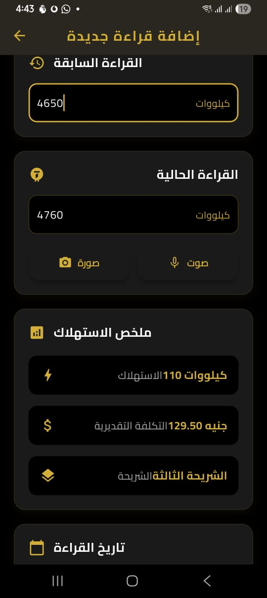

<div align="center">
  
</div>

# Electra - Your Smart Electricity Companion

## 🚀 Key Features
*   **Smart Tariff Calculation**: Automatically calculates your electricity bill based on the official Egyptian tariff tiers (2024/2025).
*   **Consumption History**: detailed records of your monthly usage, costs, and consumption patterns over time.
*   **Device Management**: Estimate power consumption for specific appliances (AC, Fridge, TV) to identify energy hogs.
*   **Cloud Sync**: Sign in with **Google** to securely backup your data using **Supabase**.
*   **Offline-First**: Works perfectly without internet for core features using a local **Hive** database.
*   **Smart Analysis**: Visual charts and insights to help you understand your consumption trends.
*   **Budget Alerts**: Set monthly spending limits and receive notifications when you're close to exceeding them.
*   **Dark Mode**: A premium, battery-saving dark UI designed for modern devices.

---

## 🛠️ Technology Stack
*   **Frontend**: Flutter & Dart.
*   **State Management**: `flutter_bloc` (Cubit pattern) & `get_it` for Dependency Injection.
*   **Backend & Auth**: **Supabase** (PostgreSQL, Auth, Realtime).
*   **Local Database**: **Hive** (NoSQL key-value database) for fast, offline-first storage.
*   **Animations**: `animate_do` for smooth UI transitions.
*   **Charts**: `fl_chart` for consumption analysis visualization.
*   **Typography**: `google_fonts` (Cairo & Outfit) for modern Arabic/English support.

---

## 📱 App Screenshots
Experience the modern design and fluid animations of Electra.

<div align="center">
  <table>
    <tr>
      <td align="center"><br /><b>Home Screen</b></td>
      <td align="center"><br /><b>Add New Reading</b></td>
      <td align="center"><br /><b>Consumption History</b></td>
    </tr>
    <tr>
      <td align="center"><br /><b>Usage Analysis</b></td>
      <td align="center"><br /><b>Device Management</b></td>
      <td align="center"><br /><b>User Profile</b></td>
    </tr>
  </table>
</div>

---

## 🏁 Getting Started
1.  **Clone the repository**:
    ```bash
    git clone https://github.com/eyadsyam/electricity_consumption_calculator.git
    ```
2.  **Install dependencies**:
    ```bash
    flutter pub get
    ```
3.  **Generate Database Code** (if applicable):
    ```bash
    dart run build_runner build
    ```
4.  **Run the app**:
    ```bash
    flutter run
    ```

---

## 🤝 Contributing
Contributions are welcome! Please fork the repository and submit a pull request for any enhancements or bug fixes.

---
